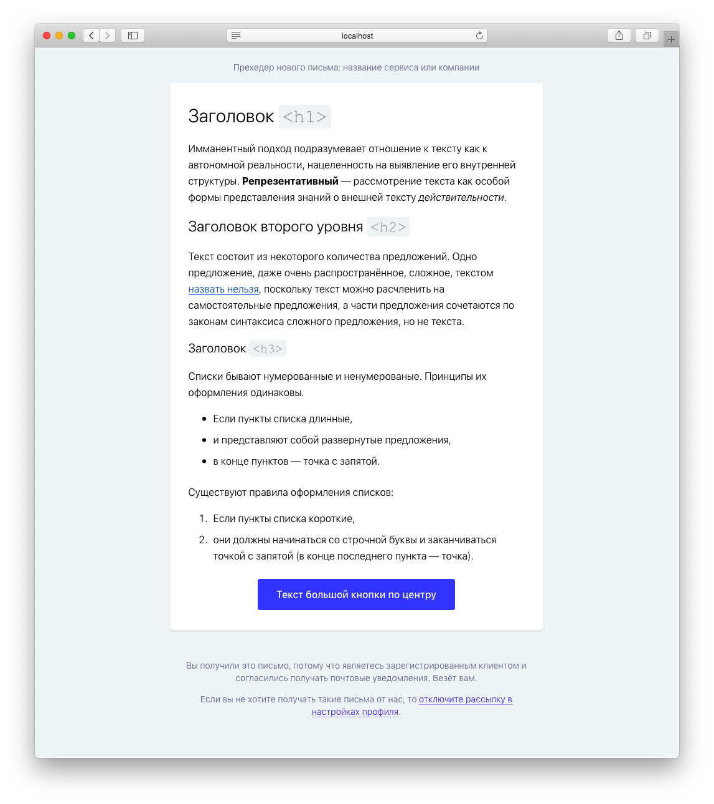

# 📮 «Печкин» — инструмент для вёрстки писем
Gulp-сборщик «Печкин» помогает быстро начать вёрстку писем

**Демо-письмо**: https://sglazov.github.io/pechkin/reference-mail/

<details>
  <summary>Скрин демо-письма</summary>
  
</details>

## С чего начать?
1. Склонировать репозиторий в папку `my-mails`, перейти в созданную папку проекта, удалить скрытую папку `.git`:
    ```console
    git clone https://github.com/sglazov/pechkin.git my-mails && \ 
    cd $_ && \
    rm -rf ./.git
    ```

1. Перед первым запуском нужно установить зависимости:
    ```console
    npm i
    ```

1. Запустить сборку с вотчером:
    ```console
    npm run start
    ```
1. Запустить сборку с минификацией, типографом, инлайнером стилей и без вотчеров:
    ```console
    npm run build
    ```

<a href="https://promopult.ru/promopult/career&?utm_source=pechkin">
  
</a>

## Как всё устроено
В корне «Печкина» есть директория `mails` в которой находятся отдельные шаблоны для каждого письма.

Запуск сборки с вотчером происходит по команде в корне проекта:
```console
npm run start
```

### Шаблонизация
Для шаблонизации использован [Nunjucks](https://mozilla.github.io/nunjucks/templating.html). Файлы разметки живут в `app/src/`: `components` — для компонентов, `layouts` — для лэайута и всё, что с ним связано; письма размещаются в `mails/`.

Стандартный лйэаут письма находится в `app/src/layouts/default.html`.

Набор снипетов-помощников для вывода типовых блоков `macro` находится в `projects/reference-mail/src/templates/utils/utils.html`. Пример использования есть внутри этого файла.

### Стили
Используемый препроцессор — [SASS](https://sass-scss.ru/).

Готовый CSS компилируются в файл `app/src/layouts/styles` (не попадает в `git`, смотрите файл `.gitignore`) и инлайнится в документе с помощью [`gulp-inline-css`](https://github.com/jonkemp/gulp-inline-css).

### Графика
Вся графика размещается в `app/src/images`, собираются в `public_html/images/` с сохранением структуры.

Для сжатия растовой графики рекомендуется использовать [Squoosh](https://squoosh.app/).

## Структура папок и файлов
```
├── gulpfile.js/                      # Конфиг Gulp.js
│   ├── tasks/                        # Gulp-такси
│   │   ├── server.js                 # Таск browser-sync
│   │   ├── styles.js                 # Таск сборки стилей из SCSS для инлайна
│   │   ├── template.js               # Таск шаблонизации: nunjucks, markdown, inline-css
│   │   └── watch.js                  # Бдительные вотчеры изменений
│   ├── utils/                        # Помогаторы
│   ├── paths.js                      # Пути к ресурсам проекта
│   ├── config.js                     # Конфиг gulp-сборки: путь, структура и т.п.
│   └── index.js                      # Основные задачи
├── resources/                        # Файлы для работы: макеты, данные и проч.
├── .editorconfig                     # Конфигурационный файл IDE
├── .gitignore                        # Список исключённых файлов из Git
├── package.json                      # Файл-конфиг «Печкина»: пакеты, скприты, выходные данные
├── CHANGELOG.md                      # Летопись версий
└── README.md                         # Документация «Печкина» (вы сейчас здесь, кстати)
```

## ⚗️ В тему
* https://www.caniemail.com/ ★
* http://emailframe.work/
* https://litmus.com/resources/free-responsive-email-templates ★
* https://www.campaignmonitor.com/email-templates/
* https://foundation.zurb.com/emails.html
* https://mjml.io/ ★
* https://tedgoas.github.io/Cerberus/
* https://github.com/mailchimp/email-blueprints
* https://github.com/InterNations/antwort
* https://www.muicss.com/docs/v1/email/boilerplate-html
* Поддерживаемые CSS-свойства в разных почтовых клиентах: https://www.campaignmonitor.com/css/
* https://github.com/dudeonthehorse/kilogram ★ — к сожалению, не поддерживается автором
* https://github.com/dudeonthehorse/normalize.email.css
* https://github.com/dudeonthehorse/kilogram.css
* https://templates.mailchimp.com/development/css/client-specific-styles/
* https://templates.mailchimp.com/resources/email-client-css-support/
* https://caniuse.email/ ★
* https://code.market/product/amp-ready-email-template-premium-bundle/
* 🇷🇺 https://vc.ru/design/75639-kak-pravilno-verstat-pisma-rekomendacii-i-trebovaniya-dlya-verstalshchika
* https://github.com/wildbit/postmark-templates
* http://emailclientmarketshare.com/
* https://github.com/post/post-email - Builder email using [PostHTML](https://github.com/posthtml/posthtml) & [PostCSS](https://github.com/postcss/postcss)
* https://howtotarget.email/ — список хаков для задания стилей и разметки для конкретных email-клиентов
